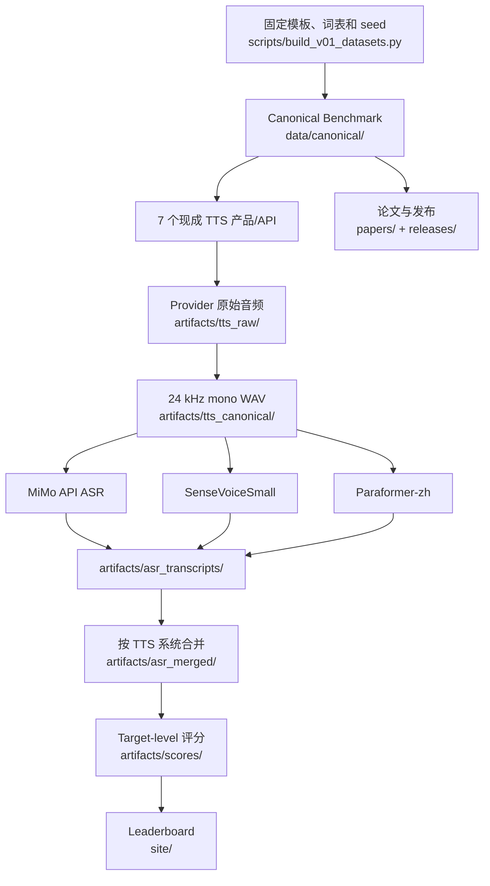

# CN-NewsTTS Bench 项目文件全景梳理

> 更新时间：2026-08-01<br>
> 仓库位置：`/Users/shijunluo/研究/cn_news_tts_bench`<br>
> 目录结构说明：[`docs/directory_layout.md`](directory_layout.md)<br>
> 当前 HEAD：`378d9b1c1529b1370754c6dbe1e5a4d55d026788`

## 1. 项目性质

CN-NewsTTS Bench 不是模型训练项目，而是以下流程组成的评测工程：

```text
确定性合成并标注 Benchmark 文本
  → 7 个现成 TTS 产品/API 推理
  → 原始音频格式统一为 24 kHz mono WAV
  → 3 路现成 ASR 推理
  → 按 TTS 系统合并 transcript
  → target-level 规则评分
  → 排行榜、论文和发布归档
```

因此，最容易混淆的概念应这样区分：

| 常用说法 | 本项目中的准确含义 | 位置 |
|---|---|---|
| 原始数据 | 固定脚本合成并完成 target 标注的 raw-input Benchmark 文本；没有抓取的真实新闻库 | `data/canonical/`、`scripts/build_v01_datasets.py` |
| 清洗后的文本数据 | 不存在“真实新闻原文 → 清洗新闻”的阶段 | 无 |
| 原始音频 | 7 家 TTS provider/API 原样返回的 WAV 或 MP3 | `artifacts/tts_raw/` |
| 清洗/标准化音频 | 统一为 24 kHz、单声道 WAV 的 canonical audio | `artifacts/tts_canonical/` |
| 模型 | 7 个被测 TTS 产品和 3 个 ASR 路由；仓库只保存配置标签和调用代码 | `configs/public/`、`scripts/` |
| 模型训练产物 | **不存在**；没有 checkpoint、optimizer state、loss curve 或 fine-tune output | 无 |
| 模型推理产物 | TTS 音频和 ASR transcript | `artifacts/tts_*`、`artifacts/asr_transcripts/` |
| 评分产物 | 合并 transcript、target score、分类汇总和榜单 | `artifacts/asr_merged/`、`artifacts/scores/` |
| 投稿文件 | arXiv 源稿与 PDF、ISCSLP 匿名稿、最终上传 PDF | `papers/`、`output/submission/` |
| 发布文件 | checksum、Zenodo 说明、GitHub Pages 数据 | `releases/`、`site/` |

## 2. 当前顶层结构

```text
cn_news_tts_bench/
  data/
    canonical/
    runtime/
  configs/
    public/
    local/
  artifacts/
    tts_raw/
    tts_canonical/
    asr_transcripts/
    asr_merged/
    scores/
  papers/
    arxiv/
    iscslp2026/
    icassp2027/
  releases/
    v0.1/
  output/
    submission/
    outreach/
    qa/
  scripts/
  docs/
  site/
```

根目录还保留常规仓库文件：`README.md`、`README.en.md`、`SUBMIT.md`、`CONTRIBUTING.md`、许可证、`.gitignore` 和 `.github/`。

旧顶层目录 `results/`、`paper/`、`release/`、`logs/`、`tmp/`、`examples/`、`submissions/` 和 `tools/` 已不再使用。

## 3. 当前规模

整个项目约 **4.6 GB**，工作区约 **14,335 个文件**。

| 目录 | 约占用 | 说明 |
|---|---:|---|
| `artifacts/` | 4.5 GB | 音频、ASR、合并结果与评分数据 |
| `artifacts/tts_raw/` | 2.0 GB | provider 原始返回音频及 manifest |
| `artifacts/tts_canonical/` | 2.5 GB | 24 kHz mono WAV |
| `artifacts/asr_transcripts/` | 17 MB | 三路 ASR 输出及运行分片 |
| `artifacts/asr_merged/` | 3.2 MB | 按 TTS 系统合并的 scorer 输入 |
| `artifacts/scores/` | 3.1 MB | target score、汇总和榜单 |
| `data/` | 7.0 MB | canonical 数据及本地 runtime shards |
| `output/` | 4.8 MB | 投稿 PDF、沟通草稿和 QA 材料 |
| `papers/` | 664 KB | arXiv 与会议稿件 |
| `scripts/` | 116 KB | 10 个 Python 脚本 |
| `docs/` | 约 64 KB | 项目说明、协议与审计 |
| `configs/` | 约 64 KB | public 配置及 ignored local 配置 |
| `site/` | 60 KB | GitHub Pages 榜单 |
| `.git/` | 1.4 MB | 正式 Git 对象；旧 checkpoint 大对象已经清理 |

## 4. 数据流



## 5. `data/`：Benchmark 输入

### 5.1 `data/canonical/`

这是固定、可发布、可版本化的 Benchmark source of truth。

| 文件 | 内容 |
|---|---|
| `dev.jsonl` | 200 条开发记录、252 个 targets，其中 248 个自动可评 |
| `test_public.jsonl` | 800 条公开测试记录、1,008 个 targets，其中 992 个自动可评 |
| `dev.sample.jsonl` | CI 与文档使用的最小样例 |
| `schema.json` | 数据字段、枚举与约束 |
| `dataset_summary.json` | seed、生成日期、规模和类别分布 |

总计：1,000 条记录、1,260 个 targets、1,240 个自动可评 targets、20 个 optional targets。

数据由 `scripts/build_v01_datasets.py` 使用 seed `20260620` 确定性生成。它不是线上日志、用户数据、公司内部数据或复制的新闻文章。

### 5.2 `data/runtime/`

共 32 个本地文件，主要包括：

- TTS provider 分片输入；
- MiMo ASR 五路 shard manifest；
- 个别缺失音频重试清单；
- lane/probe ID 列表。

这些文件只服务本地运行，可重建，整个目录被 Git 忽略。

## 6. `configs/`：公开配置与本地凭证

### 6.1 `configs/public/`

| 文件或目录 | 用途 |
|---|---|
| `site_metadata.json` | 榜单模型、voice、ASR ensemble 和展示元数据 |
| `tts_api_config.schema.json` | 本地 TTS 配置 JSON Schema |
| `tts_api_config.example.json` | 不含密钥的配置样例 |
| `api_config_builder.html` | 浏览器本地配置生成器 |
| `examples/asr_results/` | CI 和评分器输入样例 |

### 6.2 `configs/local/`

`tts_api_config.local.json` 包含真实 API 配置，已满足以下条件：

- 由根 `.gitignore` 和目录内 `.gitignore` 双重忽略；
- 文件权限为 owner-only：`-rw-------`；
- 脚本默认从这里读取；
- 不应上传、粘贴或写进 issue。

## 7. `artifacts/tts_raw/`：TTS 原始输出

目录按 split 划分：

```text
artifacts/tts_raw/
  dev/
  public_test/
  smoke/
```

### 7.1 正式原始音频

| split | 音频数量 | metadata 数量 | 约占用 |
|---|---:|---:|---:|
| `dev/` | 1,400 | 4 | 401 MB |
| `public_test/` | 5,600 | 8 | 1.6 GB |

provider 子目录包括：

- `aliyun_tts`
- `aws_polly`
- `azure_speech_tts`
- `google_cloud_tts`
- `mimo`
- `minimax_tts`
- `volcengine_tts`

AWS 与 MiniMax 原始返回 MP3，其余主要为 WAV。这里保存 provider 原样返回的音频，不作为统一评测格式。

### 7.2 Manifest 和审计

`dev/` 与 `public_test/` 根目录保存：

- `manifest.jsonl`
- `manifest.clean.jsonl`（public test）
- `status.json`
- `resolved_provider_config.redacted.json`
- `errors.jsonl`、`missing_audio.jsonl`（public test）
- provider retry note 与 generation audit。

所有音频路径已经改为仓库相对路径，不再依赖旧的 `Downloads` 绝对路径。

### 7.3 `smoke/`

包含 11 份 API smoke-test 音频和 7 份 redacted JSON 报告，不进入正式榜单。

## 8. `artifacts/tts_canonical/`：标准化音频

| split | WAV 数量 | 约占用 |
|---|---:|---:|
| `dev/` | 1,400 | 505 MB |
| `public_test/` | 5,600 | 2.0 GB |

所有正式音频统一为：

- WAV；
- 24 kHz；
- 单声道；
- 每个 TTS 系统与每条样本一个文件。

`public_test/checksums.sha256` 对 5,600 份 public canonical WAV 做逐文件校验。Canonical audio 是最昂贵的可复现资产之一，因为商用模型版本与 voice 行为可能随时间变化。

## 9. `artifacts/asr_transcripts/`：ASR 推理输出

使用三路现成 ASR：

| 路由 | 模型/服务 |
|---|---|
| MiMo API ASR | `mimo-v2.5` |
| SenseVoiceSmall | `iic/SenseVoiceSmall` |
| Paraformer-zh | `iic/speech_paraformer-large_asr_nat-zh-cn-16k-common-vocab8404-pytorch` |

仓库没有保存这两个本地 ASR 模型的权重；运行时由外部缓存加载。

`public_test/` 的三个 canonical transcript 文件各有 5,600 行，共 16,800 条推理记录。MiMo 的 shard 和 refusal 重试备份也保存在该目录，但被 Git 忽略。

`dev/` 共 10 个文件，用于调试和对照，也被 Git 忽略。

## 10. `artifacts/asr_merged/`：合并后的评分输入

`scripts/merge_asr_transcripts.py` 把三路 transcript 按 TTS provider 重新组织为：

```text
artifacts/asr_merged/{split}/{model_id}.asr.jsonl
```

每行结构是：

```json
{"id": "test_000001", "asr": {"mimo_v2_5_asr": "...", "sensevoice_small": "...", "paraformer_zh": "..."}}
```

`public_test/` 包含 7 个模型文件和 1 个 merge summary；每个模型 800 行。`dev/` 和 `dev_two_asr_check/` 属于本地诊断输出。

## 11. `artifacts/scores/`：评分与榜单

```text
artifacts/scores/
  dev/                    # 本地 dev 分数，ignored
  public_test/            # 7 个产品的正式评分
  example_model/          # CI/旧示例评分，ignored
  submissions/            # 榜单投稿 metadata、manifest 和可选音频
  leaderboard.csv
  leaderboard.json
```

每个正式模型目录包含：

- `summary.json`
- `target_scores.csv`
- `category_scores.csv`
- `group_scores.csv`
- `domain_scores.csv`

这些文件全部是由 scorer 派生的数据，可以从 canonical dataset 和 merged ASR result 重建。

## 12. 模型与训练文件结论

被评测 TTS 产品包括 Volcengine/Doubao、Azure、Google Cloud、MiniMax、Aliyun CosyVoice、MiMo 和 AWS Polly。其 model/voice 标签保存在 `configs/public/site_metadata.json` 与 redacted run config 中。

扫描仓库未发现 `.pt`、`.pth`、`.ckpt`、`.onnx`、`.safetensors`、`.tflite`、TensorFlow `.pb` 等模型权重，也没有训练循环、optimizer、loss、epoch、fine-tuning dataset 或训练日志。

准确结论是：

- 项目调用现成模型做推理；
- 不训练 TTS；
- 不训练 ASR；
- 不存在“模型训练后的数据”；
- `artifacts/` 保存的都是推理、格式转换、合并和评分产物。

## 13. `papers/` 与 `output/submission/`

### 13.1 arXiv

```text
papers/arxiv/preprint.md
papers/arxiv/preprint.pdf
```

这是公开预印本源文件与 PDF。

### 13.2 ISCSLP 2026

`papers/iscslp2026/` 保存：

- `main.tex`
- `refs.bib`
- `ISCSLP2026.sty`
- `IEEEtran.bst`
- `figures/leaderboard.{pdf,png}`
- `main.pdf`

LaTeX 的 `.aux`、`.bbl`、`.blg`、`.log`、`.out` 已归入 `output/qa/latex/iscslp2026/`。

实际提交文件：

```text
output/submission/iscslp2026/CN-NewsTTS_Bench_ISCSLP2026_Anonymous.pdf
```

它与 `papers/iscslp2026/main.pdf` 内容一致。

### 13.3 ICASSP 2027

`papers/icassp2027/` 当前只有占位 README，没有实际稿件。

## 14. `output/`

| 目录 | 内容 | 可重建性 |
|---|---|---|
| `submission/` | 最终会议上传 PDF | 必须保存 |
| `outreach/` | 厂商 issue 与沟通邮件草稿 | 建议保存 |
| `qa/pdf_renders/` | 匿名 PDF 的 5 张逐页检查图 | 可重建 |
| `qa/latex/` | LaTeX 中间文件 | 可重建 |
| `qa/logs/` | TTS、ASR、scoring 历史日志 | 可选保留 |

`output/qa/` 整体被 Git 忽略。

## 15. `releases/` 与站点

### 15.1 `releases/v0.1/`

- `core_checksums.legacy-layout.sha256`：重构前旧路径布局的历史清单；
- `core_checksums.sha256`：当前目录布局的核心文件清单；
- `zenodo/README.md`：本地 Zenodo 占位与说明。

大型 Zenodo ZIP 没有保存在当前工作区，外部公开记录仍是 canonical archive。

### 15.2 `site/`

`site/index.html`、`style.css`、`leaderboard.js` 和 `leaderboard.json` 构成 GitHub Pages 公开榜单。`site/leaderboard.json` 是聚合脚本从 `artifacts/scores/public_test/` 和 `configs/public/site_metadata.json` 生成的展示副本。

## 16. Git 跟踪与忽略策略

应跟踪：

- `data/canonical/`
- `configs/public/`
- `configs/local/.gitignore`
- public canonical ASR transcript
- public merged ASR result
- public scores 与 leaderboard
- scripts、docs、site、README、licenses
- arXiv 稿件和发布审计文件

默认忽略：

- `configs/local/*`
- `data/runtime/`
- `artifacts/tts_raw/`
- `artifacts/tts_canonical/`
- dev ASR、dev merged results、dev scores
- ASR shard 与 backup
- submission audio
- `output/qa/`
- `.DS_Store`、`__pycache__`、日志和 PID。

`.git/` 曾因两个 Codex checkpoint tree 保存旧视频、`node_modules`、Remotion cache 和 ZIP 而达到约 2.7 GB。2026-08-01 清除 checkpoint 引用并运行 Git GC 后降至约 1.4 MB；正式 commit、branch、tag 和工作区文件未改变。

## 17. 保存优先级

### 必须优先保存

1. `data/canonical/`
2. `scripts/`
3. `configs/public/` 和安全保存的 `configs/local/`
4. `artifacts/asr_transcripts/public_test/`
5. `artifacts/asr_merged/public_test/`
6. `artifacts/scores/public_test/` 与 leaderboard
7. `papers/` 和 `output/submission/`
8. `releases/`、README、licenses、docs 和 site

### 成本高但理论上可重建

1. `artifacts/tts_canonical/`
2. `artifacts/tts_raw/`
3. 三路 ASR 的全部原始推理输出

商用 API 版本和 voice 可能变化，所以即使理论上可重跑，也应把已有音频和 transcript 视为重要归档资产。

### 容易重建

- `data/runtime/`
- dev scores
- `output/qa/`
- site 的 leaderboard JSON 副本
- `.DS_Store`、`__pycache__`、PID 和临时日志。

### 绝不能公开

- `configs/local/tts_api_config.local.json`
- API key、token、secret、service-account JSON
- 未脱敏 provider 配置
- 未授权的公司内部、用户或业务数据。

## 18. 目录重构记录

2026-08-01 完成以下迁移：

| 旧路径 | 新路径 |
|---|---|
| `data/*.jsonl`、schema、summary | `data/canonical/` |
| `data/_runtime_shards/` | `data/runtime/` |
| public configs 与工具 | `configs/public/` |
| 根目录本地 API config | `configs/local/` |
| `results/tts_generation/*/raw_audio/` | `artifacts/tts_raw/` |
| `results/tts_generation/*/audio_wav_24k_mono/` | `artifacts/tts_canonical/` |
| `results/asr_transcripts/` | `artifacts/asr_transcripts/` |
| `results/asr_results/` | `artifacts/asr_merged/` |
| `results/per_model*`、leaderboard | `artifacts/scores/` |
| `paper/` | `papers/` |
| `release/` | `releases/` |
| `output/pdf/` | `output/submission/` |
| vendor drafts | `output/outreach/` |
| logs、PDF renders、LaTeX intermediates | `output/qa/` |

同时更新了脚本默认路径、CI、README、投稿说明、release audit、manifest 内部路径和 ASR transcript 的 `audio_path`。旧绝对路径已经清除。
